# Viettel Digital Talent Cloud 2025 - Mini Project

Author: **[Your Name]**

## Table of Contents
- [0. Requirements](#0-requirements)
- [1. Kubernetes Setup](#1-kubernetes-setup)
- [2. ArgoCD Setup](#2-argocd-setup)
- [3. Jenkins Setup](#3-jenkins-setup)
- [4. CI/CD Pipeline](#4-cicd-pipeline)
- [5. Monitoring](#5-monitoring)
- [6. Security](#6-security)

---

## 0. Requirements

- For project requirements and background, refer to the documentation or provided project brief.

---

## 1. Kubernetes Setup

This project uses Kubernetes (K8s) as the orchestration platform.

**Installation Steps:**
```shell
# Example: Install kubectl and minikube
curl -LO "https://dl.k8s.io/release/$(curl -L -s https://dl.k8s.io/release/stable.txt)/bin/linux/amd64/kubectl"
sudo install -o root -g root -m 0755 kubectl /usr/local/bin/kubectl
minikube start
```

**Cluster status:**
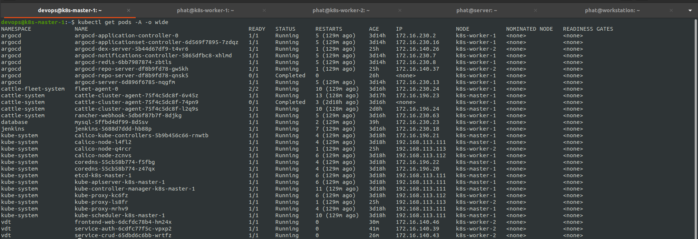

- Check your cluster nodes and pods:
```shell
kubectl get nodes
kubectl get pods -A
```

---

## 2. ArgoCD Setup

ArgoCD is used for GitOps-based deployment automation.

**Installation:**
```shell
kubectl create namespace argocd
kubectl apply -f https://raw.githubusercontent.com/argoproj/argo-cd/stable/manifests/install.yaml
```
- Switch service to NodePort for easier access:
```shell
kubectl patch svc argocd-server -n argocd -p '{"spec": {"type": "NodePort"}}'
```
- Retrieve initial admin password:
```shell
kubectl -n argocd get secret argocd-initial-admin-secret -o jsonpath="{.data.password}" | base64 -d
```

**ArgoCD Interface:**
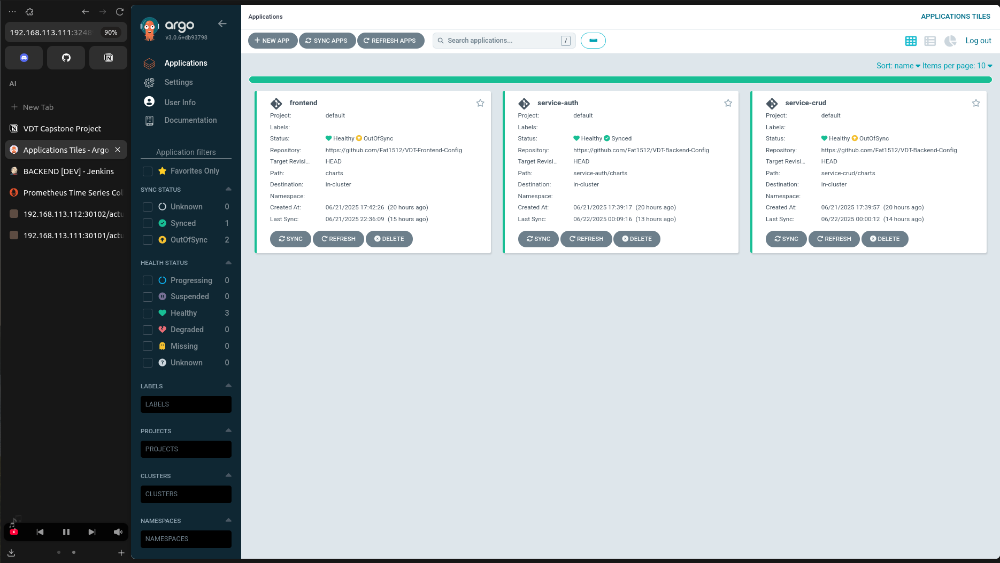
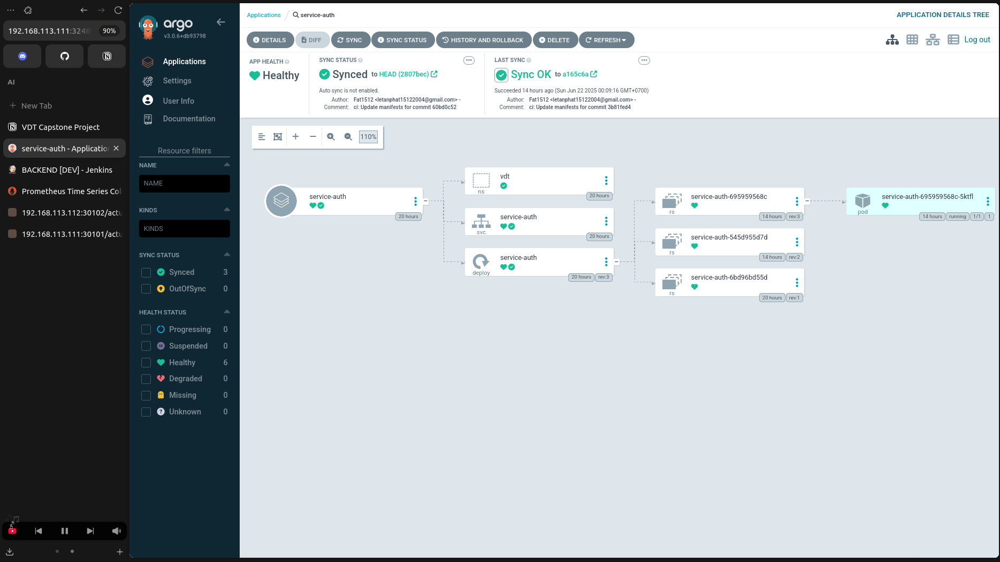
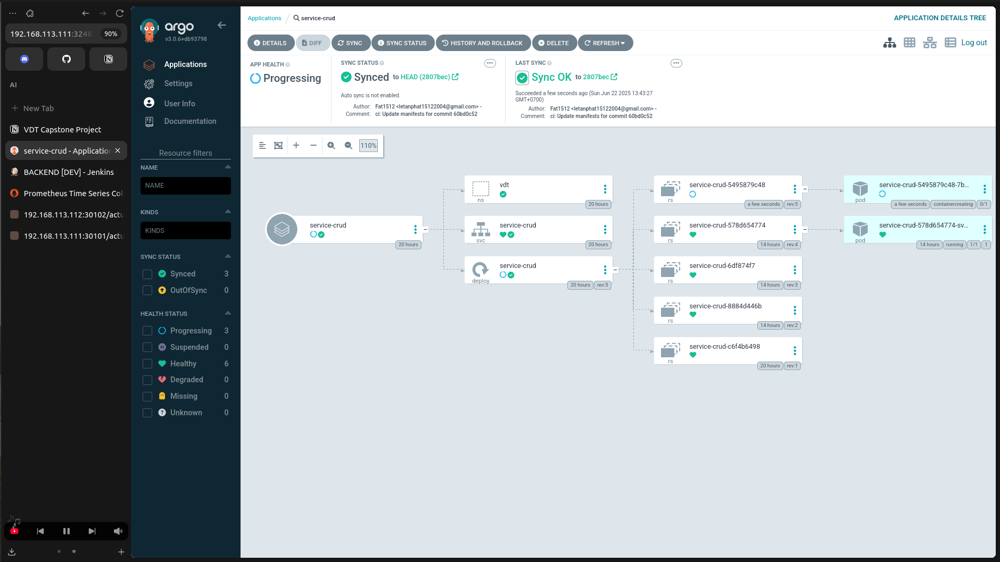
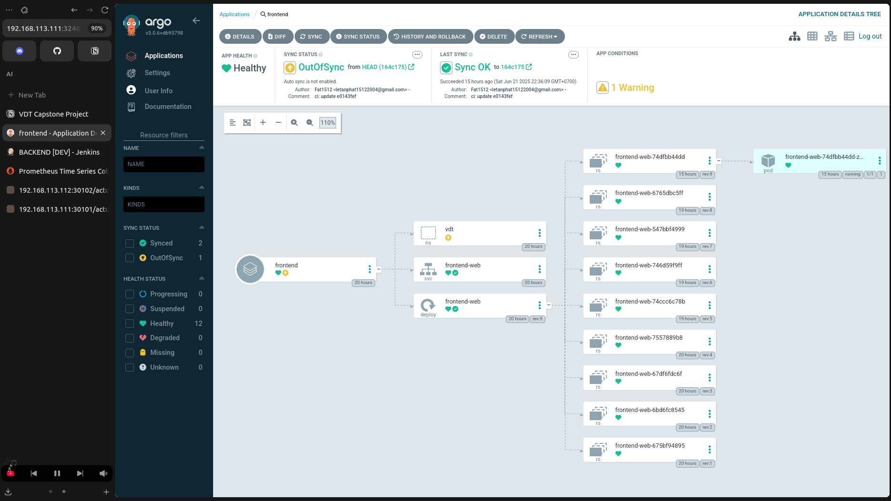

---

## 3. Jenkins Setup

Jenkins is used for automating CI/CD pipelines.

**Jenkins Interface and Pipelines:**
- Jenkins main dashboard:
  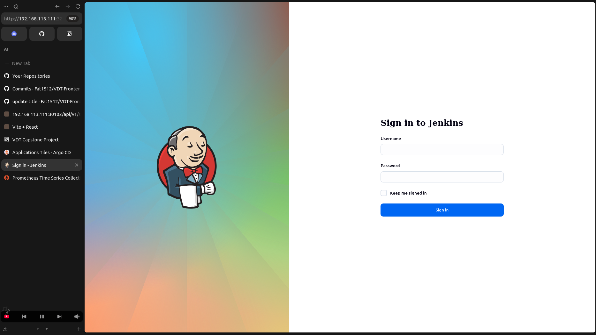
- Backend pipeline:
  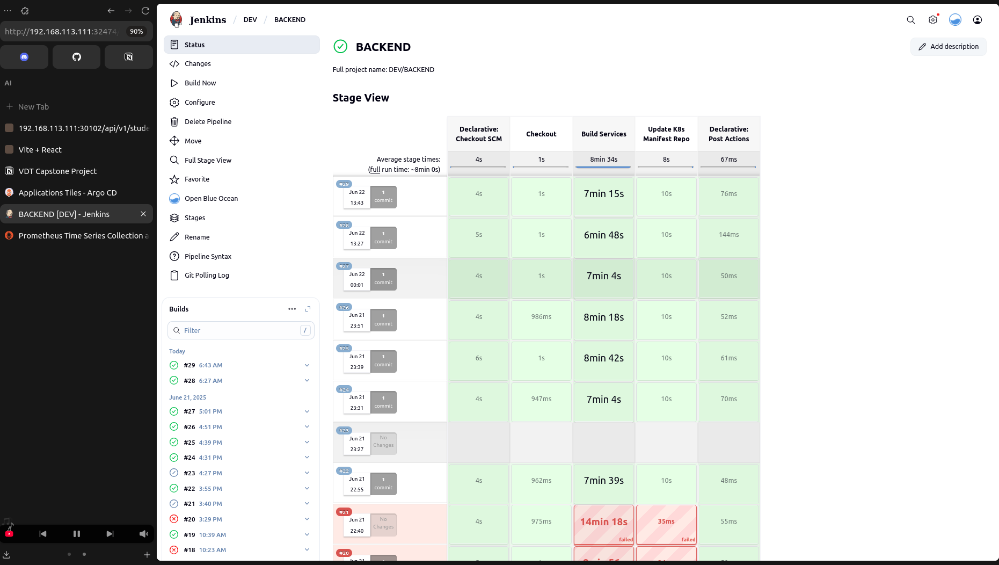
- Frontend pipeline:
  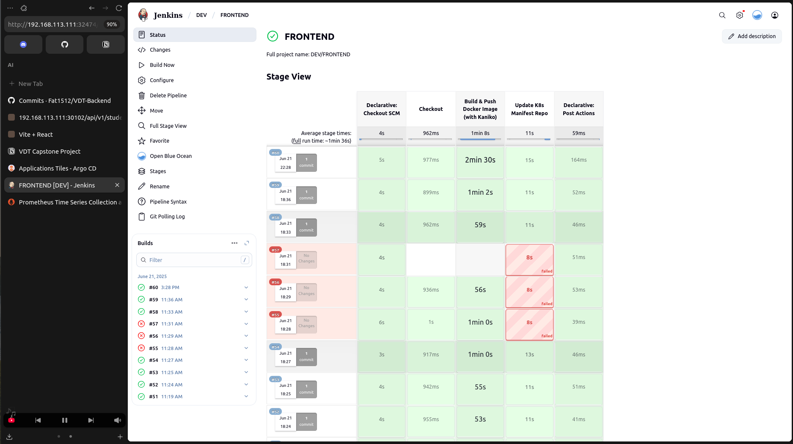

---

## 4. CI/CD Pipeline

CI/CD automates application build, test, and deployment.

- Example pipeline trigger:
  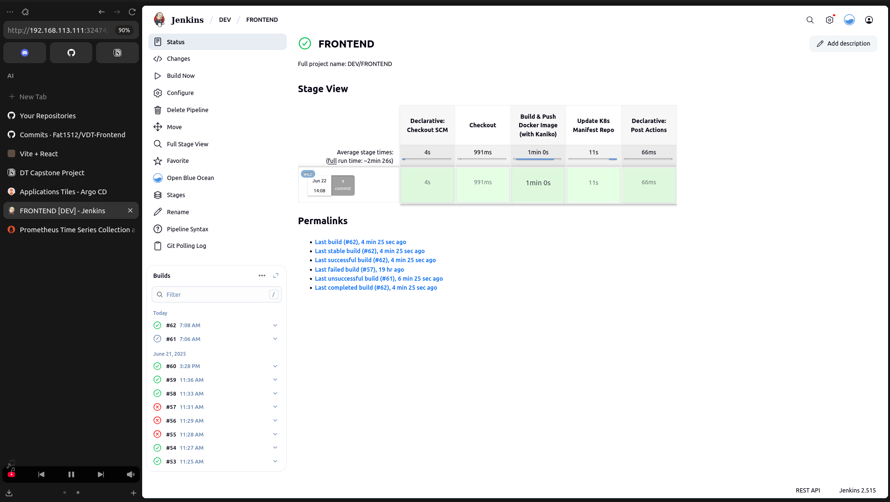
- Sample outputs:
  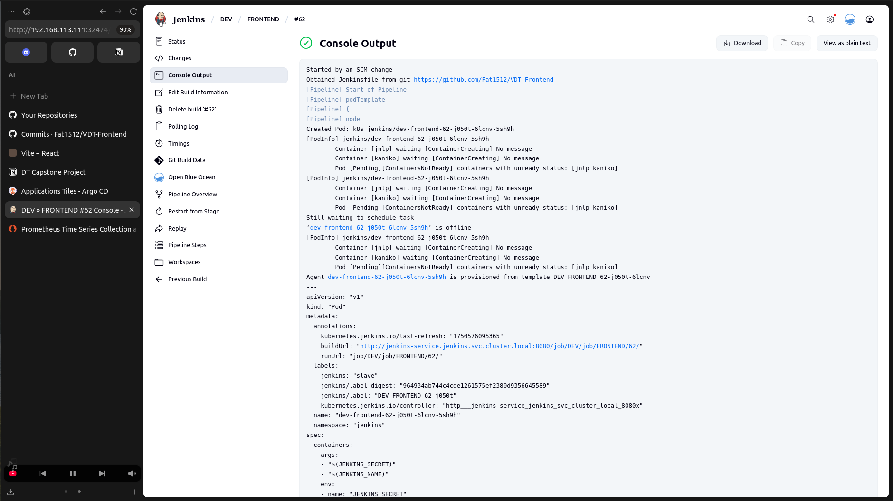
  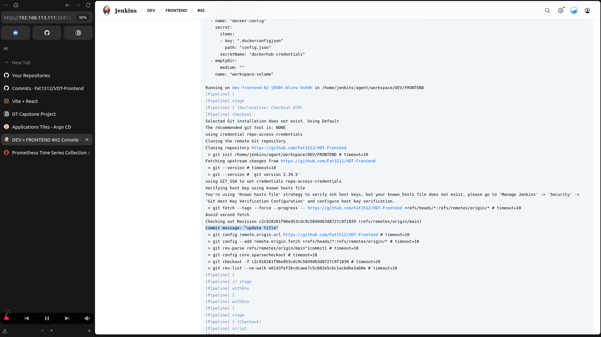
  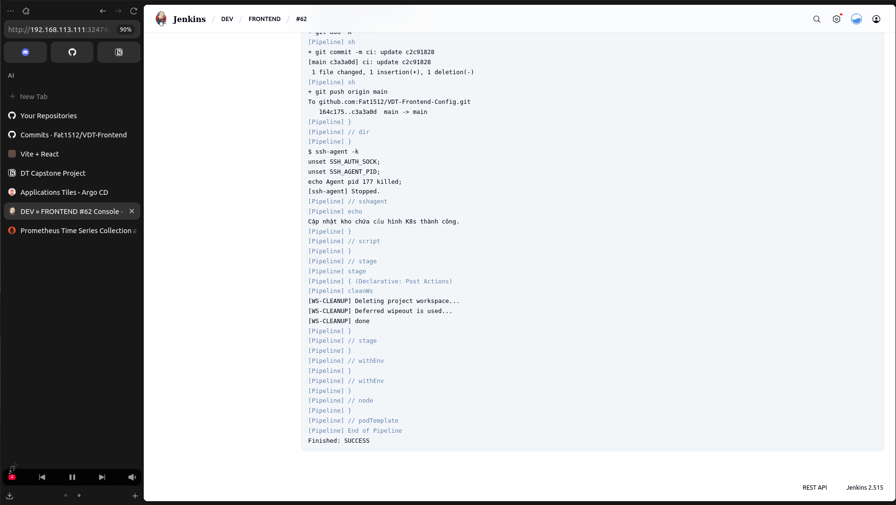

---

## 5. Monitoring

Monitoring is implemented to ensure system health and performance.

- Backend monitoring demo:
  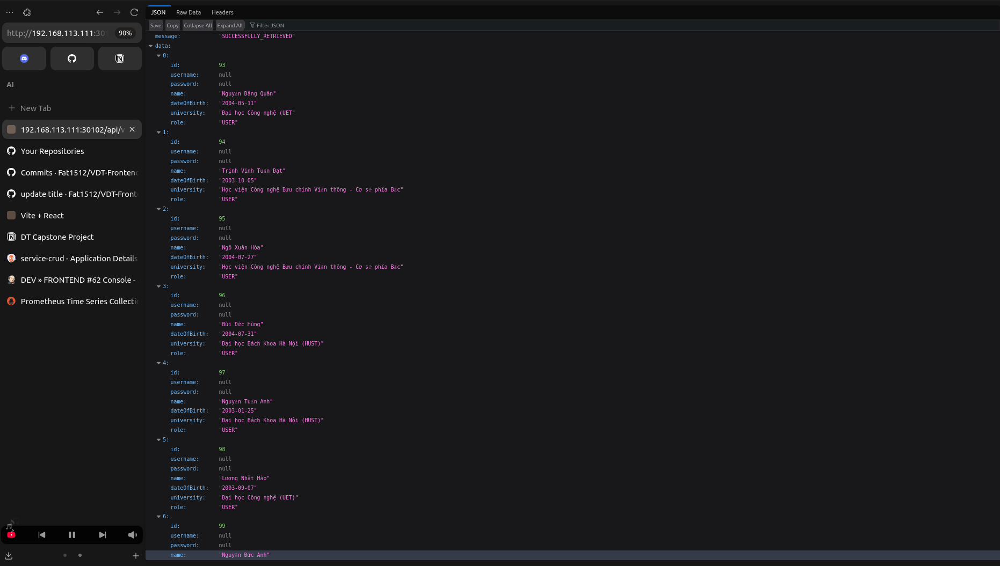
- Frontend monitoring demo:
  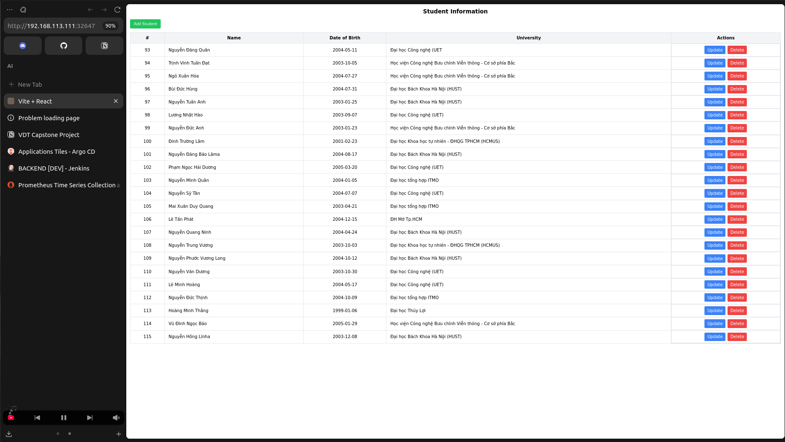

---

## 6. Security

Security measures include best practices for cluster and pipeline safety.

- Example configuration:
  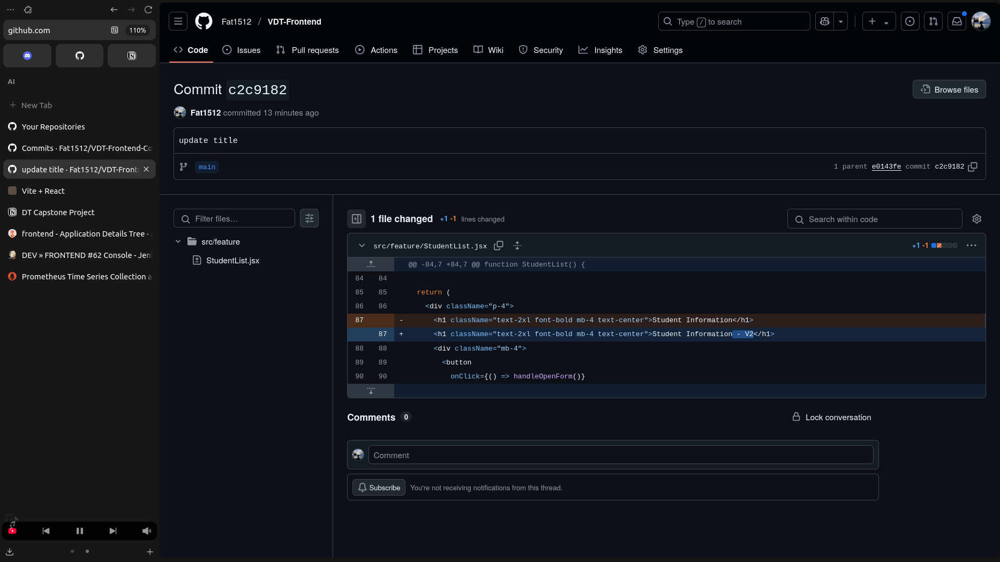
- Implement authentication, RBAC, and secure traffic (HTTPS) for all endpoints.

---

> **Note:** Images in this README are stored in the [asset folder](https://github.com/Fat1512/Viettel-Digital-Talent-Cloud-2025/tree/main/asset).  
> For more details and scripts, explore each section and the repository folders.
