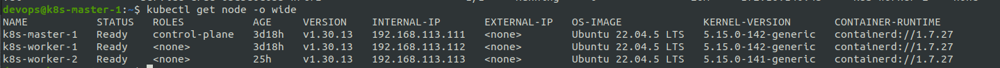
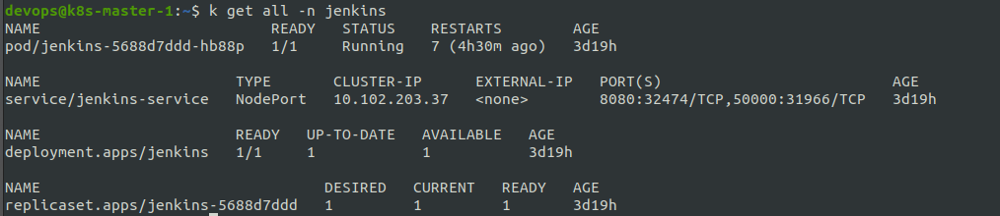

# Viettel Digital Talent 2025 - Capstone Project

## Table of Contents
- [0. Requirements](#0-requirements)
- [1. Kubernetes Deployment](#1-kubernetes-deployment)
- [2. Web Application & DevOps Practices](#2-web-application--devops-practices)
- [3. Containerization](#3-containerization)
- [4. Continuous Integration & Delivery](#4-continuous-integration--delivery)
- [5. Automation](#5-automation)
- [6. Monitoring](#6-monitoring)
- [7. Logging](#7-logging)
- [8. Security](#8-security)

## 1. Kubernetes Deployment

- **Tool:** kubeadm

- **Installation steps & config:** Please check the following [README.md](kubeadm/README.md)

- **Short description** This repo showcases the Web application deployment in k8s together with 
DevOps tools such as K8s, Jenkins, ArgoCD, Prometheus, ...

- **System validation logs:**
    ````shell
    kubectl get nodes -o wide
    kubectl get pods -A -o wide
    ````
- **Screenshots:**

- 
- 

---

## 2. ArgoCD & Jenkins Setup

### Setup

- **ArgoCD:** 
  - Manifest: [ArgoCD Helm Chart](charts/web)
  - Installing Manifest
  ````shell
  kubectl create namespace argocd
  kubectl apply -n argocd -f https://raw.githubusercontent.com/argoproj/argo-cd/stable/manifests/install.yaml
  ````
  - Check deployment
  ````shell
  k get all -n argocd
  ````
  
  
- **Jenkins:**
  - Manifest: [Jenkins Helm Chart](charts/api)

  - Installing Manifest
  ````shell
  cd jenkins
  kubectl apply -f jenkins-ns.yaml
  kubectl apply -f jenkins-pv.yaml
  kubectl apply -f jenkins-sa.yaml
  kubectl apply -f jenkins-deployment.yaml
  kubectl apply -f jenkins-service.yaml
  ````
  - Check deployment
  ````shell
  k get all -n jenkins
  ````

  
  

### Application Deployment using Helm Chart
  
  
  
  


## 3. Containerization

- **Optimized Dockerfiles (multi-stage) for web and api.**
- **docker-compose:**  
    ```sh
    docker compose up -d
    ```
- **Build logs:**  
    - [web build log](app/web/web_build.log)
    - [api build log](app/api/api_build.log)
- **Running containers:**  
    

---

## 4. Continuous Integration & Delivery

- **CI:** GitHub Actions/Jenkins for build & test ([ci.yaml](.github/workflows/ci.yaml))
- **CD:** Jenkins + ArgoCD auto-deploy on tag/new image
    - Pipeline config: [Jenkinsfile](Jenkinsfile)
    - 
    - 
- **Logs:**
    - [CI log](ci.log)
    - [CD log](cd.log)

---

## 5. Automation

- **Ansible playbooks:**
    - [Inventory](ansible/inventory.yml)
    - [Playbook](ansible/playbook.yml)
    - [Roles](ansible/roles/)
- **Usage:**
    ```sh
    ansible-playbook -i inventory.yml playbook.yml
    ```
- **Sample Output:**  
    

---

## 6. Monitoring

- **Prometheus:**  
    - [prometheus setup](prometheus/)
    - [prometheus-operator setup](prometheus-operator/)
- **UI & Target list:**  
      
    

---

## 7. Logging

- **EFK stack (Elasticsearch, Fluentd, Kibana):**  
    - [Fluentd config](fluentd/)
- **Kibana search example:**  
    

---

## 8. Security

### HAProxy Load Balancer & Ingress

- **HAProxy config:** [haproxy.cfg](haproxy/haproxy.cfg)
- **Ingress config:** [ingress.yaml](k8s/ingress.yaml)
- **HTTPS Access:**  
    - Web: `https://<LB-IP>:3001/`
    - API: `https://<LB-IP>:8081/`
    - 
    - 

### Authentication & Authorization

- **API protected endpoints:** See [api repo](https://github.com/[your_api_repo])
- **Role-based access screenshots:**  
    
    

### Rate Limiting

- **Rate limiting config:** See [rateLimitation.md](docs/rateLimitation.md)
- **Test result:**  
    

---

## 9. Research/Analysis Report

- [Analysis/Research PDF](docs/research.pdf)

---

> **Note:** No web application source code is included.  
> All documentation, manifests, configs, logs, and screenshots are provided as required by the assignment.
