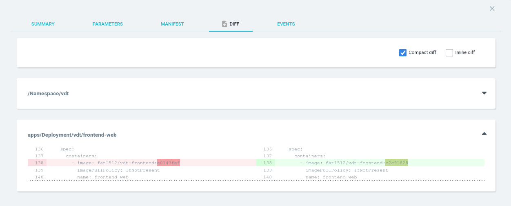
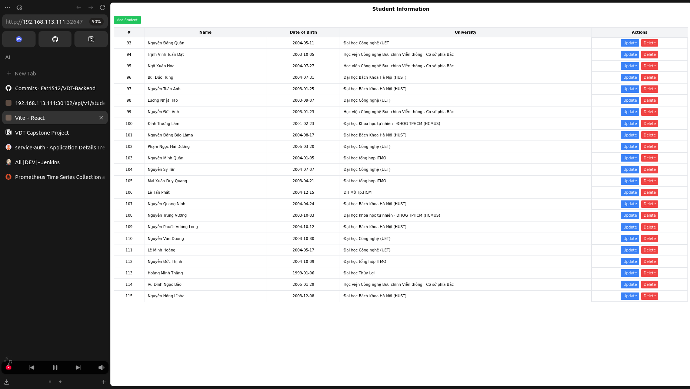

# Viettel Digital Talent 2025 - Capstone Project

## Table of Contents
- [0. Requirements](#0-requirements)
- [1. Kubernetes Deployment](#1-kubernetes-deployment)
- [2. Web Application & DevOps Practices](#2-web-application--devops-practices)
- [3. Containerization](#3-containerization)
- [4. Continuous Integration & Delivery](#4-continuous-integration--delivery)
- [5. Automation](#5-automation)
- [6. Monitoring](#6-monitoring)
- [7. Logging](#7-logging)
- [8. Security](#8-security)

## 1. Kubernetes Deployment

**Tool Used:** kubeadm

**Installation Steps & Configuration:**  
  Please refer to the detailed [kubeadm/README.md](kubeadm/README.md) for comprehensive setup instructions.

**Overview:**  
  This repository demonstrates the deployment of a complete web application ecosystem within a Kubernetes cluster. It integrates various DevOps tools, including Kubernetes itself, Jenkins for CI/CD, ArgoCD for GitOps-based delivery, and Prometheus for monitoring. The aim is to provide an end-to-end platform for scalable and robust cloud-native applications.

- **System Validation Logs:**
    ```shell
    kubectl get nodes -o wide
    kubectl get pods -A -o wide
    ```

- **Screenshots:**

- 
- 


## 2. ArgoCD & Jenkins Setup

### ArgoCD
  * **Manifest:** [ArgoCD Helm Chart](charts/web)
  * **ArgoCD Service Address:**   192.168.113.111:32489
  * **Install ArgoCD:**
  ```shell
  kubectl create namespace argocd
  kubectl apply -n argocd -f https://raw.githubusercontent.com/argoproj/argo-cd/stable/manifests/install.yaml
  ```
  * **Check Deployment:**
  ```shell
  # Patch the argocd-server service to change its type from ClusterIP to NodePort.
  kubectl patch svc argocd-server -n argocd -p '{"spec": {"type": "NodePort"}}'
  
  # Retrieve password
  kubectl -n argocd get secret argocd-initial-admin-secret -o jsonpath="{.data.password}" | base64 -d
  
  kubectl get all -n argocd
  ```
  
  

### Jenkins
  * **Manifest:** [Jenkins Helm Chart](charts/api)
  * **Jenkins Service Address:**  192.168.113.111:32474
  * **Install Jenkins:**
  ```shell
  cd jenkins
  kubectl apply -f jenkins-ns.yaml
  kubectl apply -f jenkins-pv.yaml
  kubectl apply -f jenkins-sa.yaml
  kubectl apply -f jenkins-deployment.yaml
  kubectl apply -f jenkins-service.yaml
  ```
  - **Check Deployment:**
  ```shell
  kubectl get all -n jenkins
  ```
  
  


## 3. Application Deployment via ArgoCD

### Description
  - Backend Helm Chart and values file: [Backend Config](https://github.com/Fat1512/VDT-Backend-Config)
  
  - Frontend Helm Chart and values file: [Frontend Config](https://github.com/Fat1512/VDT-Frontend-Config)
  
  - The application consists of one frontend service and two backend services.

### Application  

  ```shell
    kubectl get svc -n vdt
  ```

  

  - Frontend Service: 192.168.113.111:32647
   
  - Auth Service: 192.168.113.111:30101
  
  - Crud Service: 192.168.113.111:30102

  
  
  
  

### Demo
  
  

---

## 4. CI/CD

### Jenkinsfile
* Backend Jenkinsfile: [Backend Jenkinsfile](https://github.com/Fat1512/VDT-Backend-Config)
* Frontend Jenkinsfile: [Frontend Jenkinsfile](https://github.com/Fat1512/VDT-Frontend-Config)

### Build Logs
* Reference: [Log file](log/pipeline_log.txt)
* Example: Update frontend title and observe pipeline triggers.


* Pipeline is automatically triggered on commit changes


### Stage View


### Continuous Delivery Changes

* CD repository and DockerHub images get updated automatically after successful builds.


* ArgoCD automatically detects and synchronizes changes.



### Before and After




## 5. Monitoring

### Prometheus

  * **Prometheus Address:**  
    _Insert your Prometheus UI address here:_  
    `Prometheus UI Address: _____________________________`

  * Deploy Prometheus using Ansible:
    ```shell
    ansible-playbook -i inventory.ini deploy-prometheus.yml
    ```

    
  - [Prometheus Setup Details](prometheus)

  - **UI & Target List:**  
    

  * **Additional Kubernetes Monitoring Commands:**
    ```shell
    # Get all services in monitoring namespace
    kubectl get svc -n monitoring
    # Port-forward Prometheus
    kubectl port-forward svc/prometheus-server -n monitoring 9090:9090
    ```

---

## 6. Security

### Rate Limiting

- **Rate Limiting Configuration:** See [rateLimitation.md](docs/rateLimitation.md)
- **API Gateway or Rate Limiter Address:**  
  _Insert rate limiter endpoint here:_  
  `Rate Limiter Address: _____________________________`
- **Test Result:**  
    

### Authentication & Authorization

- **API Protected Endpoints:** See [API repo](https://github.com/[your_api_repo])
- **Section for API Endpoint Address:**  
  _Insert your API base URL here:_  
  `API Base URL: _____________________________`
- **Role-based Access Screenshots:**  
    
    
