# Viettel Digital Talent 2025 - Capstone Project

## Table of Contents

- [1. Kubernetes Deployment](#1-kubernetes-deployment)
- [2. ArgoCD & Jenkins Setup](#2-argocd--jenkins-setup)
- [3. Application Deployment via ArgoCD](#3-application-deployment-via-argocd)
- [4. CI/CD](#4-cicd)
- [5. Monitoring](#5-monitoring)
- [6. Logging](#6-logging)
- [7. Security](#7-security)

## 1. Kubernetes Deployment

**Tool:** kubeadm

**Installation Steps & Configuration**  
  Please refer to the detailed [kubeadm/README.md](kubeadm/README.md) for comprehensive setup instructions.

**Server Address:**
- Master: __192.168.111.111__  
- Worker 1: __192.168.111.112__  
- Worker 2: __192.168.111.113__
- Monitor: __192.168.111.114__

**Overview:**  
  This repository demonstrates the deployment of a complete web application ecosystem within a Kubernetes cluster. It integrates various DevOps tools, including Kubernetes itself, Jenkins for CI/CD, ArgoCD for GitOps-based delivery, and Prometheus for monitoring. The aim is to provide an end-to-end platform for scalable and robust cloud-native applications.

- **System Validation Logs:**
    ```shell
    kubectl get nodes -o wide
    kubectl get pods -A -o wide
    ```

- **Screenshots:**

- 
- 


## 2. ArgoCD & Jenkins Setup

### ArgoCD
  * **Manifest:** [ArgoCD Helm Chart](charts/web)
  * **ArgoCD Service Address:**   192.168.113.111:32489
  * **Install ArgoCD:**
  ```shell
  kubectl create namespace argocd
  kubectl apply -n argocd -f https://raw.githubusercontent.com/argoproj/argo-cd/stable/manifests/install.yaml
  ```
  * **Check Deployment:**
  ```shell
  # Patch the argocd-server service to change its type from ClusterIP to NodePort.
  kubectl patch svc argocd-server -n argocd -p '{"spec": {"type": "NodePort"}}'
  
  # Retrieve password
  kubectl -n argocd get secret argocd-initial-admin-secret -o jsonpath="{.data.password}" | base64 -d
  
  kubectl get all -n argocd
  ```
  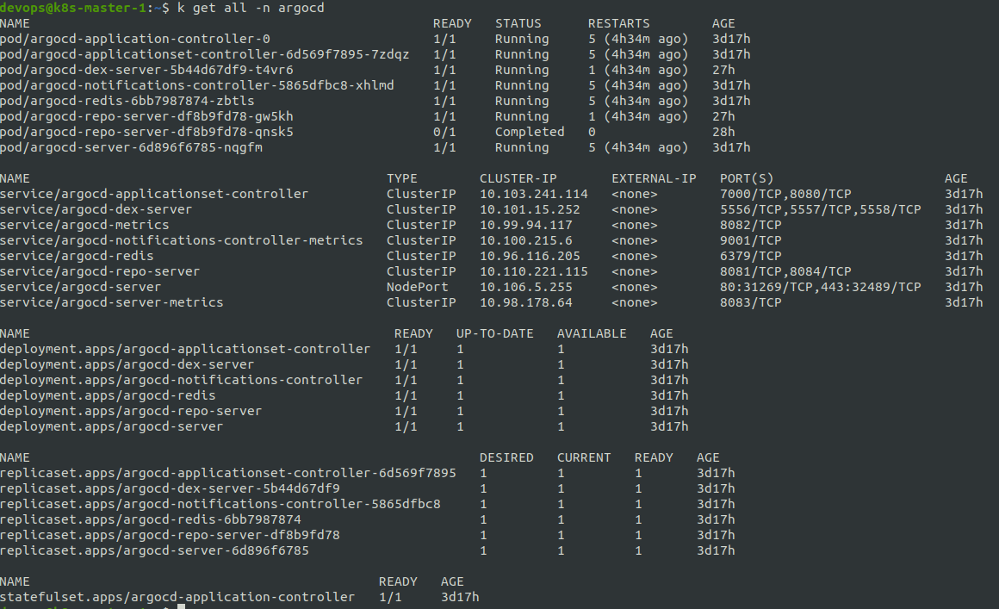
  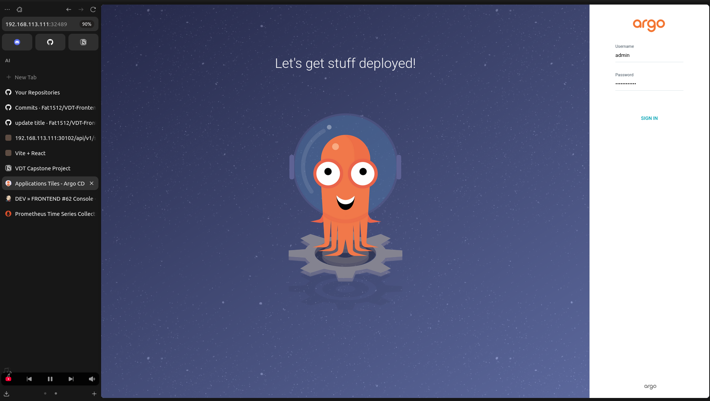

### Jenkins
  * **Manifest:** [Jenkins Helm Chart](charts/api)
  * **Jenkins Service Address:**  192.168.113.111:32474
  * **Install Jenkins:**
  ```shell
  cd jenkins
  kubectl apply -f jenkins-ns.yaml
  kubectl apply -f jenkins-pv.yaml
  kubectl apply -f jenkins-sa.yaml
  kubectl apply -f jenkins-deployment.yaml
  kubectl apply -f jenkins-service.yaml
  ```
  - **Check Deployment:**
  ```shell
  kubectl get all -n jenkins
  ```
  
  


## 3. Application Deployment via ArgoCD

### Description
  - Backend Helm Chart and values file: [Backend Config](https://github.com/Fat1512/VDT-Backend-Config)
  
  - Frontend Helm Chart and values file: [Frontend Config](https://github.com/Fat1512/VDT-Frontend-Config)
  
  - The application consists of one frontend service and two backend services.

### Application  

  ```shell
    kubectl get svc -n vdt
  ```

  

  - Frontend Service: 192.168.113.111:32647
   
  - Auth Service: 192.168.113.111:30101
  
  - Crud Service: 192.168.113.111:30102

  
  
  
  

### Demo
  
  

---

## 4. CI/CD

### Jenkinsfile
* Backend Jenkinsfile: [Backend Jenkinsfile](https://github.com/Fat1512/VDT-Backend-Config)
* Frontend Jenkinsfile: [Frontend Jenkinsfile](https://github.com/Fat1512/VDT-Frontend-Config)

### Build Logs
* Reference: [Log file](log/pipeline_log.txt)
* Example: Update frontend title and observe pipeline triggers.


* Pipeline is automatically triggered on commit changes


### Stage View


### Continuous Delivery Changes

* CD repository and DockerHub images get updated automatically after successful builds.

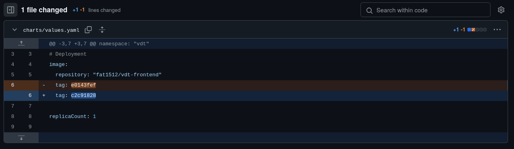
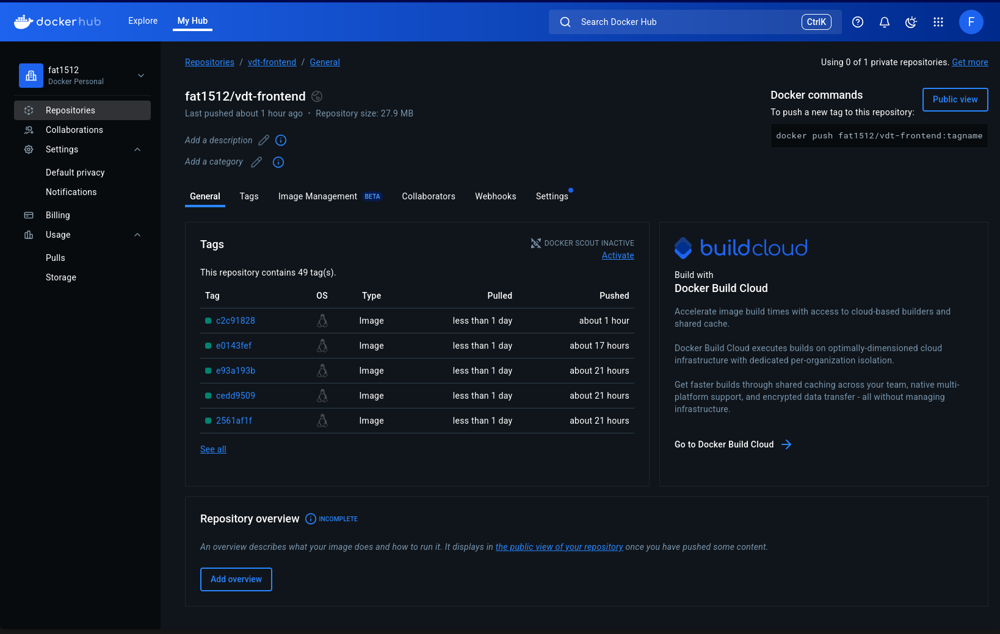

* ArgoCD automatically detects and synchronizes changes.


### Before and After


## 5. Monitoring

### Prometheus
  
  * Deploy Prometheus using Ansible:

  ```shell
  ansible-playbook -i inventory.ini deploy-prometheus.yml
  ```

  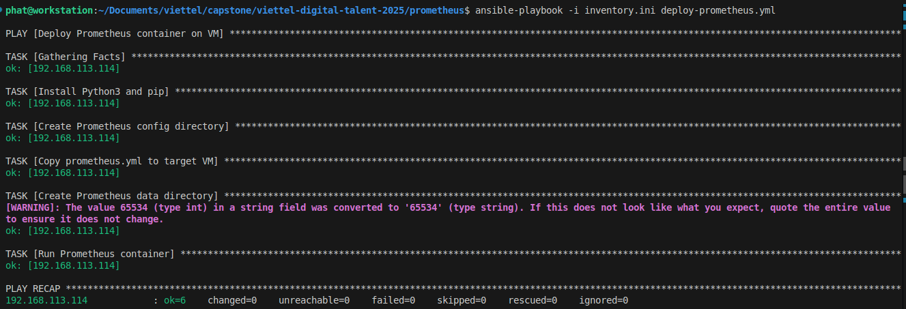

  * SSH into monitoring server and check status to ensure that container is up:

  ```shell
    docker ps
  ```
  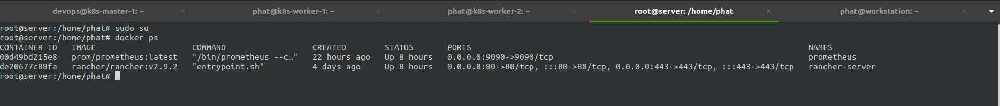

  * API service monitoring:

  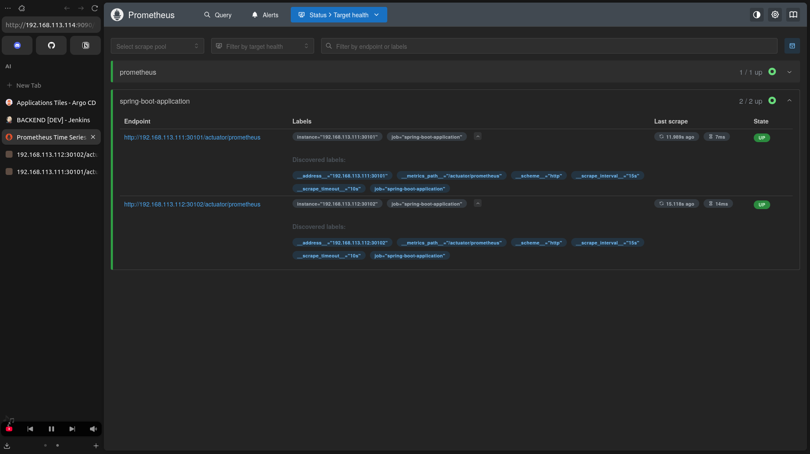
  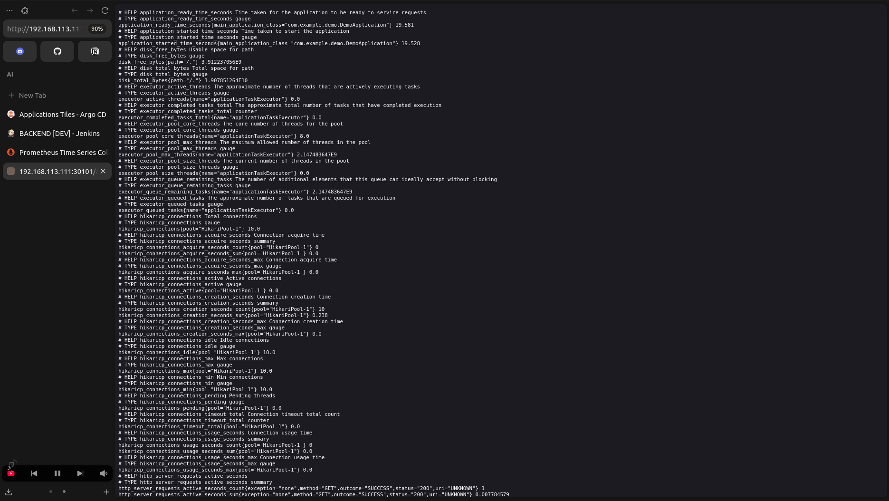
  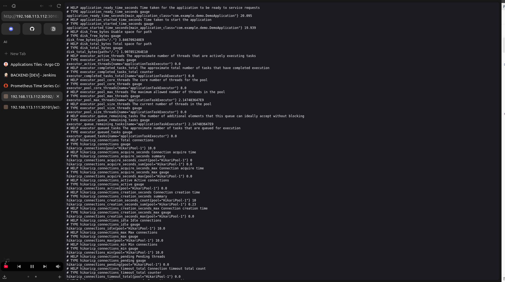

## 6. Logging 
  - To be continued

## 7. Security

### HAProxy
  - To be continued

### Authentication & Authorization

- **Solution Reference:**[Log file](log/pipeline_log.txt)
- **Security App Config:**

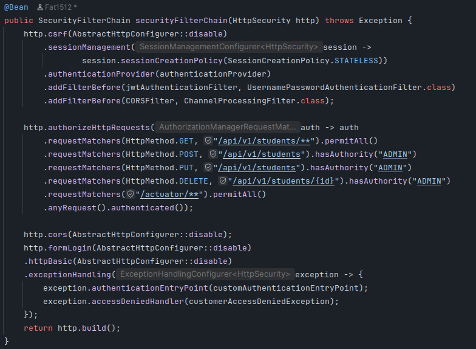

- **User role is allowed to get**

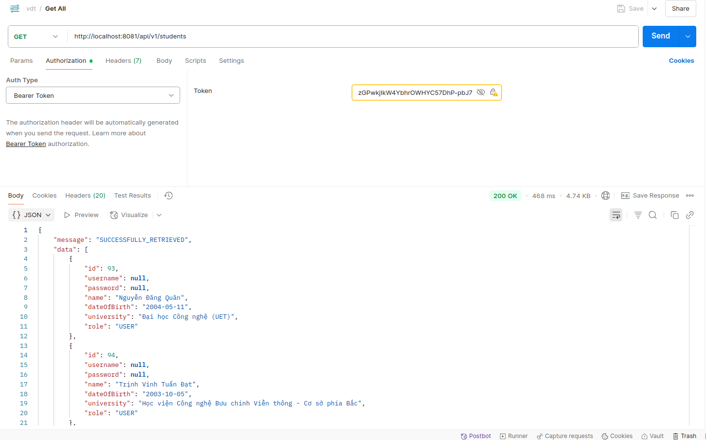

- **User role is forbidden to perform post**

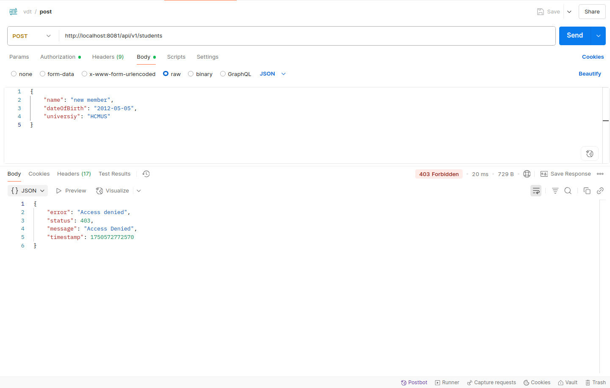

- **User role is forbidden to perform delete**

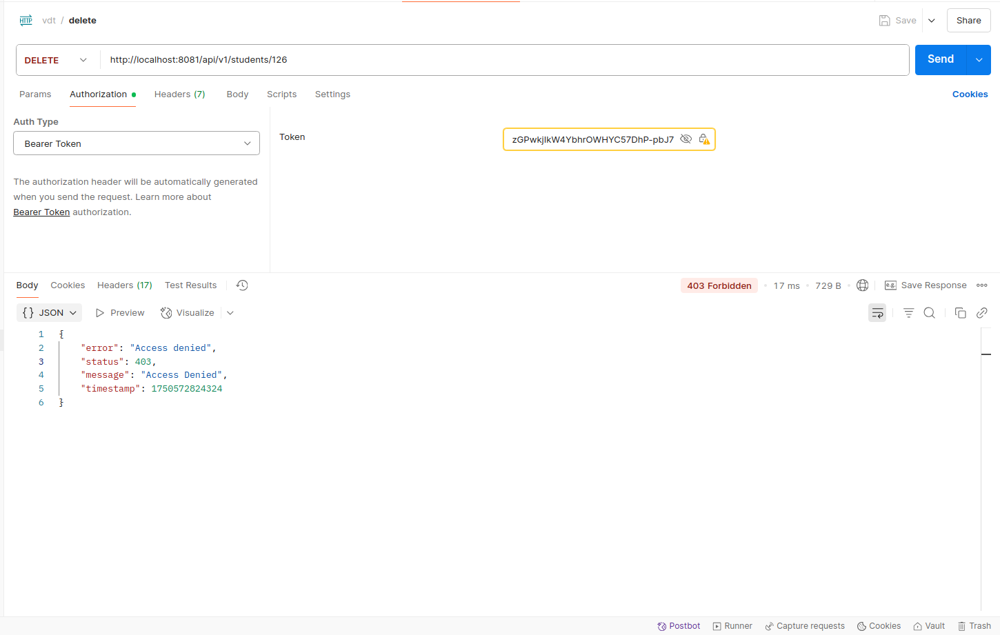


- **Admin role is allowed to get**


- **User role is allowed to perform post**


- **User role is allowed to perform post**


### Rate Limiting

- **Rate Limiting Configuration:** See [rateLimitation.md](docs/rateLimitation.md)

**Overview:**  
  The API endpoint /api/v1/students allows clients to retrieve student records. To prevent abuse and overuse, a token bucket algorithm is used to limit the number of requests.

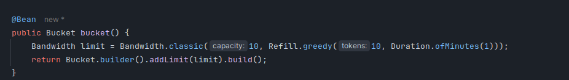

- __Capacity__: 10 tokens

- __Refill Rate__: 10 tokens per minute

- This means each client can send up to 10 requests per minute.

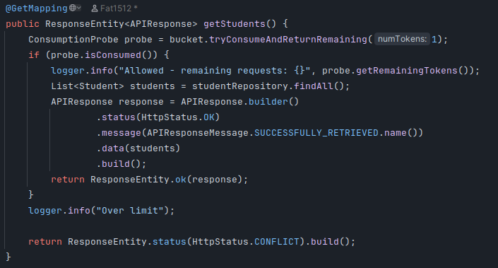

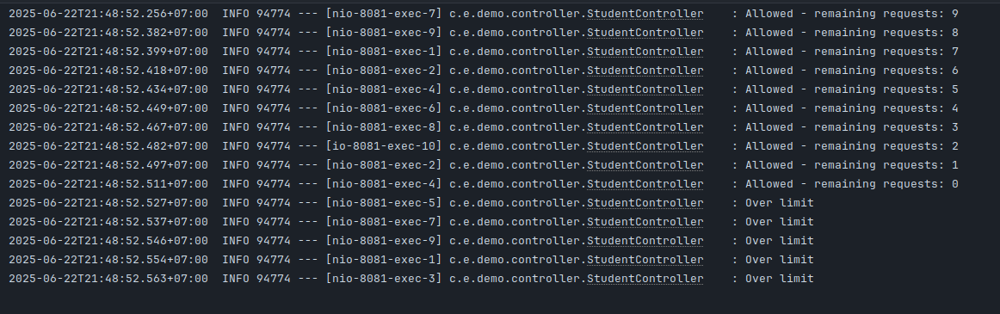

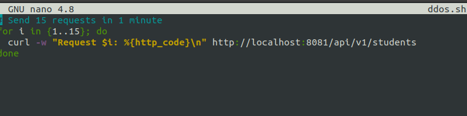

- Once all tokens are used, further requests are blocked until the bucket refills after 1 minute.

*Note*: There may be slight overlaps in token consumption due to concurrency (multiple threads accessing the bucket simultaneously), so the effective limit might occasionally exceed 10 requests per minute.