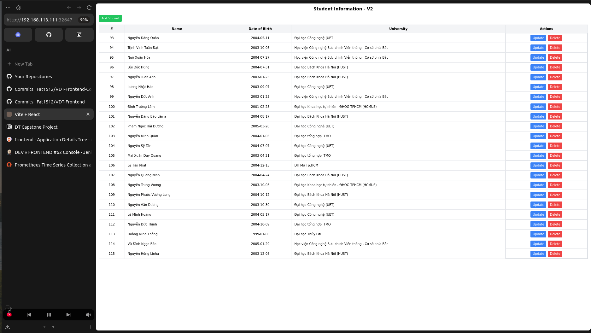

# Viettel Digital Talent 2025 - Capstone Project

## Table of Contents
- [0. Requirements](#0-requirements)
- [1. Kubernetes Deployment](#1-kubernetes-deployment)
- [2. Web Application & DevOps Practices](#2-web-application--devops-practices)
- [3. Containerization](#3-containerization)
- [4. Continuous Integration & Delivery](#4-continuous-integration--delivery)
- [5. Automation](#5-automation)
- [6. Monitoring](#6-monitoring)
- [7. Logging](#7-logging)
- [8. Security](#8-security)

## 1. Kubernetes Deployment

- **Tool:** kubeadm

- **Installation steps & config:** Please check the following [README.md](kubeadm/README.md)

- **Short description** This repo showcases the Web application deployment in k8s together with 
DevOps tools such as K8s, Jenkins, ArgoCD, Prometheus, ...

- **System validation logs:**
    ````shell
    kubectl get nodes -o wide
    kubectl get pods -A -o wide
    ````
- **Screenshots:**

- 
- 

---

## 2. ArgoCD & Jenkins Setup

### ArgoCD
  * Manifest: [ArgoCD Helm Chart](charts/web)
  * Installing Manifest
  ````shell
  kubectl create namespace argocd
  kubectl apply -n argocd -f https://raw.githubusercontent.com/argoproj/argo-cd/stable/manifests/install.yaml
  ````
  - Check deployment
  ````shell
  k get all -n argocd
  ````
  
  
### Jenkin
  * Manifest: [Jenkins Helm Chart](charts/api)

  * Installing Manifest
  ````shell
  cd jenkins
  kubectl apply -f jenkins-ns.yaml
  kubectl apply -f jenkins-pv.yaml
  kubectl apply -f jenkins-sa.yaml
  kubectl apply -f jenkins-deployment.yaml
  kubectl apply -f jenkins-service.yaml
  ````
  - Check deployment
  ````shell
  k get all -n jenkins
  ````

  
  

## Application on ArgoCD
### Description

  * Backend Helm Chart and values file: [click](https://github.com/Fat1512/VDT-Backend-Config)

  * Frontend Helm Chart and values file: [click](https://github.com/Fat1512/VDT-Frontend-Config)

  * I have 1 frontend and 2 service for backend as below

  
  
  
  
### App Demo
  
  


## 3. CI/CD
### Jenkinsfile
* Backend Jenkinsfile: [click](https://github.com/Fat1512/VDT-Backend-Config)

* Frontend Jenkinsfile: [click](https://github.com/Fat1512/VDT-Frontend-Config)
### Build log

* Make changes to title on frontend


* Pipeline triggered on commit changes


* Pipeline triggered on commit changes
### Stage view


### Changes in CD
* CD repo and Dockerhub get updated


* ArgoCD noticed the change


### Before and After




## 4. Monitoring
### Prometheus:  

  ````shell
    ansible-playbook -i inventory.ini deploy-prometheus.yml
  ````
  
- [prometheus setup](prometheus)
- **UI & Target list:**  
    

---

## 5. Security

<!-- ### HAProxy Load Balancer & Ingress

- **HAProxy config:** [haproxy.cfg](haproxy/haproxy.cfg)
- **Ingress config:** [ingress.yaml](k8s/ingress.yaml)
- **HTTPS Access:**  
    - Web: `https://<LB-IP>:3001/`
    - API: `https://<LB-IP>:8081/`
    - 
    -  -->

### Rate Limiting

- **Rate limiting config:** See [rateLimitation.md](docs/rateLimitation.md)
- **Test result:**  
    


### Authentication & Authorization

- **API protected endpoints:** See [api repo](https://github.com/[your_api_repo])
- **Role-based access screenshots:**  
    
    
