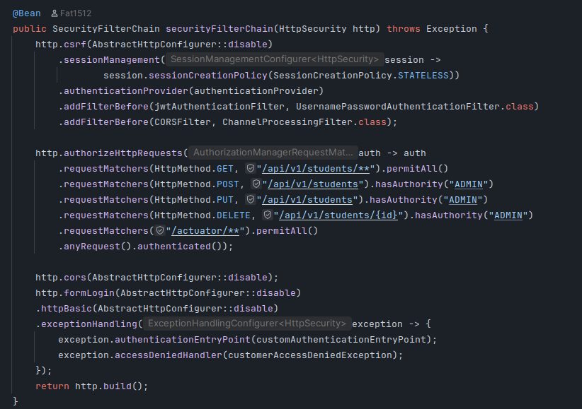

# JWT Authentication & Spring Security Authorization Solution

## Authentication Layer - JWT Implementation

**Authentication Process:**
1. User submits login credentials
2. System validates credentials against database
3. JWT token generated with user data and role
4. Token returned to client
5. Client includes token in Authorization header for subsequent requests
6. System validates token signature and expiration on each request

## Authorization Layer - Spring Security Implementation

### How Spring Security Authorization Works
Spring Security handles access control after JWT authentication succeeds. It uses the user role extracted from the validated JWT token to make authorization decisions.

**Authorization Process:**
1. JWT filter validates token and extracts user role
2. Spring Security evaluates user permissions against requested resource
3. Access granted or denied based on role and HTTP method in Security config
4. Appropriate HTTP response code returned

**Filter**
```java

@Component
@RequiredArgsConstructor
public class JwtAuthenticationFilter extends OncePerRequestFilter {

    private final JwtService jwtService;
    private final UserService userService;
    private final HandlerExceptionResolver handlerExceptionResolver;

    @Override
    protected void doFilterInternal(HttpServletRequest request, HttpServletResponse response, FilterChain filterChain)
            throws ServletException, IOException {
        String token = request.getHeader("Authorization");
        if(token == null || !token.startsWith("Bearer")) {
            filterChain.doFilter(request, response);
            return;
        }
        try {
            token = jwtService.extractToken(token);
            if(jwtService.validateToken(token)) {
                String username = jwtService.extractUsername(token);

                UserDetails userDetails = userService.loadUserByUsername(username);
                if (userDetails != null) {
                    UsernamePasswordAuthenticationToken authToken =
                            new UsernamePasswordAuthenticationToken(userDetails, null, userDetails.getAuthorities());
                    authToken.setDetails(new WebAuthenticationDetailsSource().buildDetails(request));
                    SecurityContextHolder.getContext().setAuthentication(authToken);
                }
                filterChain.doFilter(request, response);
            } else
                throw new AccessDeniedException("Expired token");
        } catch (AccessDeniedException runtimeException) {
            handlerExceptionResolver.resolveException(request, response, null, runtimeException);
        }
    }
}
```
